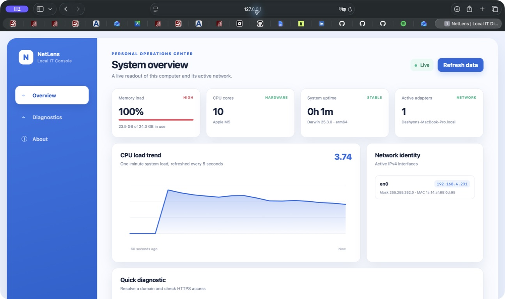

# NetLens

NetLens is a private, zero-dependency IT operations dashboard for one computer. It turns live operating-system and network information into a clean interface, then adds practical DNS, HTTPS, and local-port diagnostics.



## Why it belongs in a CIS portfolio

This is not a static mockup. NetLens connects a responsive browser interface to a working Node.js service and demonstrates:

- **Systems knowledge:** CPU load, memory use, uptime, architecture, and host details
- **Networking knowledge:** IPv4 interfaces, DNS resolution, HTTPS/TCP reachability, and local port checks
- **Secure engineering:** localhost-only default binding, strict input validation, escaped dynamic UI content, and no telemetry
- **Software delivery:** native automated tests, responsive UI, accessible labels, error states, and setup documentation

## Run it

Requirements: Node.js 18 or newer.

```bash
npm start
```

Open [http://127.0.0.1:4173](http://127.0.0.1:4173).

No package installation, account, database, API key, seed data, or sample mode is required. Every system value comes from the computer currently running NetLens.

## Use it

1. **Overview** shows current memory, processor, uptime, active network adapters, and a rolling CPU-load graph.
2. Enter a real public domain in **Quick diagnostic** to verify DNS resolution and HTTPS port access.
3. Open **Diagnostics** and check a local port. Port `4173` reports NetLens itself while the app is running.
4. Select **Refresh data** for an immediate live reading. The overview also refreshes automatically.

## Test it

```bash
npm test
```

The test suite verifies value formatting, live system data, static app delivery, API behavior, validation, and traversal protection.

## Architecture

```text
Browser dashboard
      │ JSON over localhost
Node HTTP server
      ├── OS metrics (node:os)
      ├── DNS lookup (node:dns)
      └── TCP probes (node:net)
```

The project deliberately uses only Node.js built-ins. That keeps the supply chain small and makes the app immediately runnable.

## API

| Endpoint | Purpose |
| --- | --- |
| `GET /api/system` | Current hardware, memory, uptime, load, and interfaces |
| `GET /api/diagnostics?domain=example.com` | DNS lookup and TCP/443 check |
| `GET /api/port?port=4173` | Localhost TCP port check |

## Privacy and safety

- The server listens on `127.0.0.1` by default, so other devices cannot access it.
- NetLens stores no history and sends no analytics.
- Port checks are intentionally limited to the local computer.
- Domain input is validated before any network request.

## License

[MIT](LICENSE)
