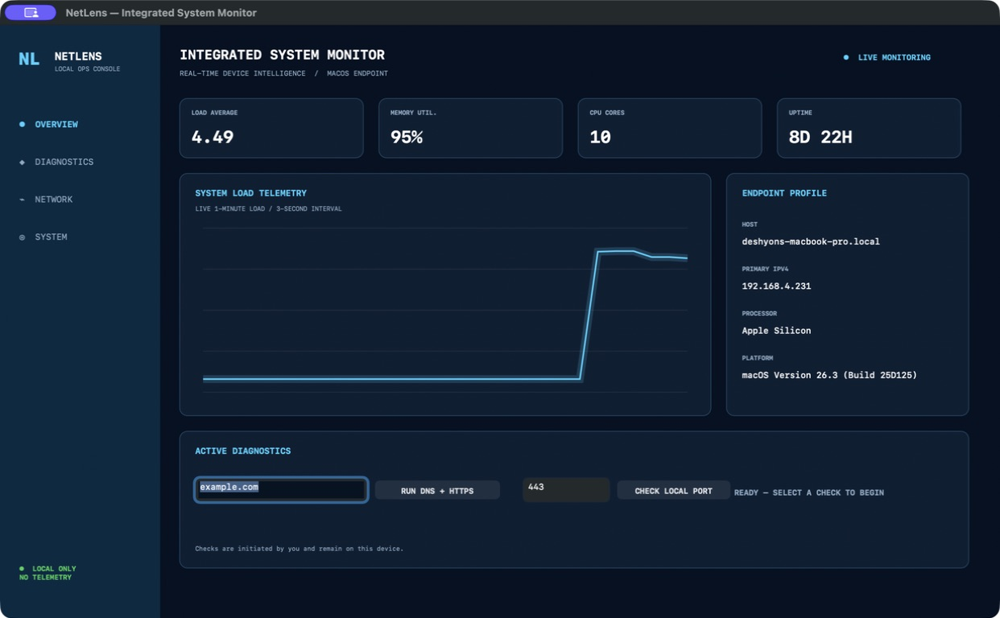

# NetLens for macOS

NetLens is a native, one-person IT operations app that turns live Mac system and network data into a compact integrated monitoring console. It is a real `.app`—not a website, template, hosted demo, or account-based service.



## What it does right now

- Displays live CPU load, physical-memory use, core count, and system uptime
- Identifies the Mac, processor, operating system, and primary IPv4 address
- Draws a rolling system-load telemetry chart every three seconds
- Tests a public domain over DNS/TCP port 443
- Checks whether a service is listening on any local TCP port
- Runs entirely on the Mac with no account, database, analytics, or sample data

## Why it stands out in a CIS portfolio

NetLens demonstrates practical knowledge across four layers:

| Area | Implementation |
| --- | --- |
| Systems | Mach memory statistics, load average, host identity, uptime |
| Networking | Interface discovery, DNS resolution, TCP connectivity with Network.framework |
| Application engineering | Native Objective-C/AppKit UI, timers, async state handling, input validation |
| Delivery | Reproducible build, ad-hoc code signing, self-test, app-bundle verification |

## Build the application

Requirements: macOS 13+ and Apple Command Line Tools.

```bash
./scripts/build_app.sh
```

The launchable application is created at:

```text
dist/NetLens.app
```

Double-click `NetLens.app`, or run:

```bash
open dist/NetLens.app
```

## Verify it

```bash
./scripts/test_app.sh
```

This builds the application, runs its live system-probe self-test, verifies the code signature, and validates the bundle metadata.

## Use the diagnostics

1. Enter a public domain such as `example.com`, then select **RUN DNS + HTTPS**.
2. Enter a local port from `1` to `65535`, then select **CHECK PORT**.
3. Green status means the destination or service is reachable; red status explains a validation or connectivity failure.

Port checks are intentionally restricted to `127.0.0.1`. NetLens is a diagnostics utility, not a network scanner.

## Project structure

```text
NetLens.app
├── Sources/NetLens/main.m       Native UI and system/network probes
├── Resources/                  App metadata and icon
├── scripts/build_app.sh        Reproducible app-bundle build
└── scripts/test_app.sh         Functional and packaging checks
```

## Privacy

NetLens stores no readings, includes no tracking code, and sends no telemetry. A network connection occurs only when the user explicitly runs a domain diagnostic.

## License

[MIT](LICENSE)
